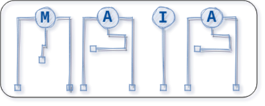

## Table of contents
* [Current State](#current-state)
* [Description](#description)
* [Requirements](#requirements)
* [BasicUse](#basicuse)
* [Contributors](#contributors)

## Current State
Maine AI Arena (MAIA) is still in early, early development and new versions will break content tailored to previous versions. All commands have had limited testing. See *todo.md* under docs for a list of known bugs and planned (short-term) features. See *version_history.md* for recent changes.

The teams under the team directory are just examples. They will change over time as I test things. Eventually, I will write a more comprehensive AI example.

## Description
MAIA is a platform designed for AI competitions that provides a modular 2D simulation environment for which students write AI to control competing agents. The goal is to give coders all the tools necessary so that they can focus primarily on analysis of information and decision-making. 

MAIA is written entirely in Python3 using only the modules included with a typical Python3 installation and tkinter for the UI. In other words, if you have Python3 on your machine plus tkinter, you can run MAIA. No fussy set up, compilation or libs needed. This was done so that novice coders can easily test their routines locally. Furthermore, students write AI routines in Python3 which are called directly by the simulation during the AI update phase. This allows students to leverage any Python libraries of their choice for the task.

MAIA is very configurable through JSON config files. Maps, teams, objects, components and items can be created by simply adding them to the JSON files. This allows the tournament master to create simple or complex scenarios. This allows for the dissemination of scenarios through JSON files.

MAIA was inspired by MIT's BattleCode competition: https://www.battlecode.org/. Whereas Battlecode differs radically year-to-year, MAIA is designed to be a stable, general platform in which different scenarios can be created. Our hope is that this will allow for coders to develop their routines into AI capable of general game playing.

## Requirements
MAIA requires:
* Python 3.8
* tkinter

## Basic Use

Simply clone or download the repo and run: `$python3 main.py`

MAIA consists of two main UI elements:
* Setup
* Simulation

`$python3 main.py` starts the Setup UI in which you can select the map and assign teams to the predetermined sides. Further configuration, adding teams, objects, components and maps is done via json files within the *settings* directory.

## Documentation
Documentation can be found in the *docs* directory. It is constantly under construction. Best thing to do before using MAIA is read through all files in the *docs* directory. The following is an itemization of each file and its purpose.

* ai.md: Gives an overview of the AI python script, the hooks used by MAIA and requirements when creating your own.
* command_instr.md: how to create commands. The basic template.
* command_list.md: list of current commands, the components that accept them, and certain command definitions.
* comps.md: Detailed list of the types of components (or ctypes).
* instructions.md: How to use MAIA, FAQ, etc.
* project_desc.md: Reason for MAIA's existence and future goals.
* version_history.md: Exactly what it sounds like.
* views.md: Breakdown of *views* which are the dictionary-based way information is fed to AI scripts from the simulation.

## Contributors
* Zachary Hutchinson - University of Maine - <zachary.s.hutchinson@maine.edu> - ACTIVE

If you would like to contribute to this project, or simply have a comment or criticism, send an email to one of the *ACTIVE* contributors.